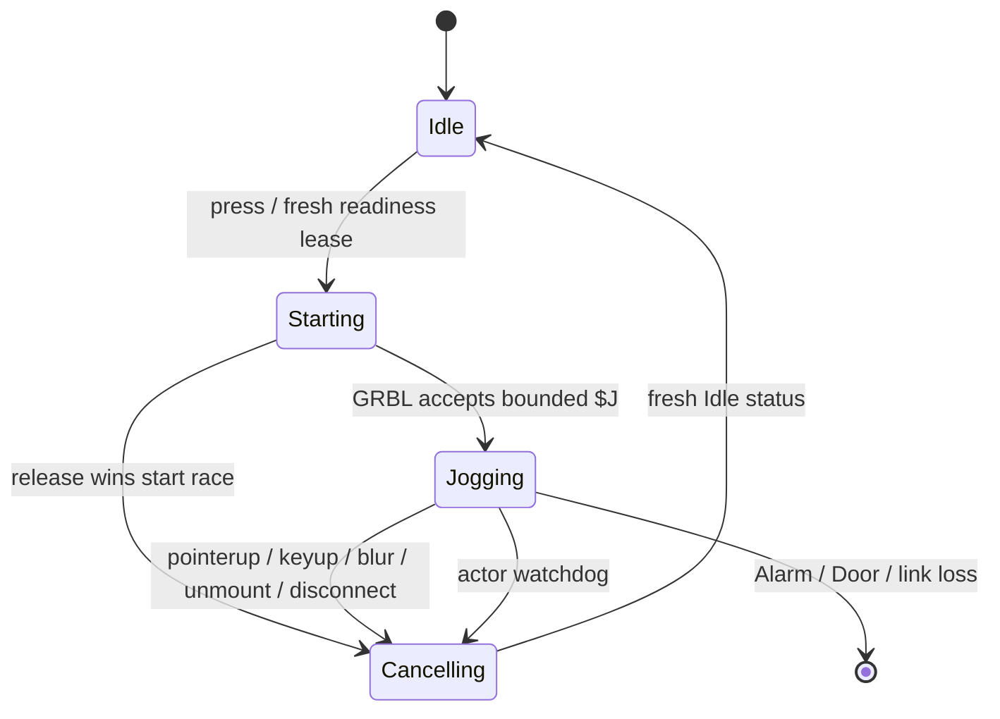

# Machine control lifecycle

Millo exposes machine motion as typed use cases owned by the single Rust
command actor. React, Tauri commands, and plugins never format `$H`, `$J=`, WCS,
spindle, or coolant lines. This keeps serial ordering, authorization, timeout,
and cancellation policy in one place.

## Homing

`ControllerSnapshot.homing` is session-scoped and has five states:

| State | Meaning |
| --- | --- |
| `Unreferenced` | `$H` has not completed in this connection session |
| `Homing` | the actor owns an outstanding `$H` response |
| `Homed` | `$H` completed and a fresh `Idle` status supplied `MPos` |
| `Invalidated` | a previous reference was lost by reset, recovery reconnect, or configuration change |
| `Failed` | the bounded homing operation ended without a verified fresh `Idle` |

Starting requires an explicit operator confirmation, a profile with homing
installed, `$22=1`, and a fresh `Idle` or `Alarm` state. The actor reads
`$23-$25`, `$27`, and `$130-$132`, calculates a bounded timeout from travel and
seek/locate rates, and starts one extended `$H` transaction. It polls that
transaction in short slices, leaving realtime Status, Hold, Reset, and
Disconnect available without blocking the UI.

Terminal `ok` is not treated as completed motion. The actor waits for fresh
`Idle` and a machine position, then derives the usable XYZ envelope from the
reported home position, homing direction mask, configured travel, and pull-off.
Timeout or terminal failure sends Feed Hold and publishes `Failed`; confirmed
Reset remains available if the controller must be cleared.

Reset banners, Ctrl-X, automatic transport recovery, and relevant controller or
profile changes discard the envelope and invalidate the reference. A reconnect
therefore cannot silently retain machine-coordinate limits from the preceding
electrical session.

## Continuous jog

Continuous jog is not a loop in React and does not use an event-pumping wait.
One press starts a deliberately long but bounded one-axis `$J=G91 G21 ...`
inside the actor. Releasing sends the GRBL realtime Jog Cancel byte `0x85`.

Cancellation is race-safe. The UI interactor assigns a sequence before IPC; if
release occurs before the start response arrives, the accepted jog is cancelled
immediately after that response. Repeated release events are idempotent. The
actor watchdog also sends `0x85` once after the calculated travel duration plus
a margin, so a missing browser event cannot leave the command unbounded.

The operator shell cancels on:

- pointer up or pointer cancel, including outside the button;
- window blur or document visibility loss;
- keyboard key release;
- panel unmount or mode teardown;
- profile/control disable and transport disconnect.

Keyboard jog is opt-in. Arrow keys move X/Y, Page Up/Down move Z, and brackets
move optional A. Repeats and Alt/Ctrl/Meta combinations are ignored. Events
originating in input, textarea, select, content-editable, or textbox controls
never start motion.

## Motion boundaries

After successful homing, XYZ continuous movement is bounded against the
captured machine-coordinate envelope with a fixed interior margin. Before
homing, or after invalidation, it is bounded by the selected profile's per-axis
travel and `maxJogDistanceMm`; this is a conservative command distance, not a
claim that the current physical location is known.

The optional A axis has its own degree-based profile: total travel, maximum jog
angle, and maximum degrees per minute. Its limits never reuse the linear
millimetre limit. If firmware reports `$113`, that controller rate is used;
otherwise the explicit rotary profile rate is the fallback. Standard three-axis
GRBL profiles do not expose A controls.

## WCS and outputs

G54-G59 selection is a typed Idle-only transition. The actor writes exactly one
selected coordinate-system word, rereads `$G`, and fails unless the modal state
matches. Changing WCS invalidates any cached verified Z datum.

Spindle and coolant are also typed Idle-only operations. Controller-managed
spindle start validates RPM against fresh `$31..$30`, writes `S` plus M3/M4, and
verifies `$G`; manual-spindle profiles cannot start it. Flood M8 and mist M7 are
separate profile capabilities and are rejected before transport I/O unless
explicitly enabled. Stop operations M5/M9 remain available as fail-safe output
deactivation.

## Extension boundary

Core UI reaches motion through `MachineCommandGateway`, so panels can be
replaced without acquiring serial ownership. External plugin grants remain
narrower: a plugin receives only capabilities declared by its manifest and
approved by the operator. Adding continuous motion or raw output control to the
plugin SDK requires a separate capability and threat-model decision; the new
core endpoints are not granted implicitly.

## Verification

The regression suite covers actor-owned homing, reset and recovery invalidation,
machine-envelope limits, profile limits before homing, release-before-start,
idempotent cancellation, optional A units, WCS modal verification, and output
capability enforcement. Run the complete gate with `npm run verify`.
