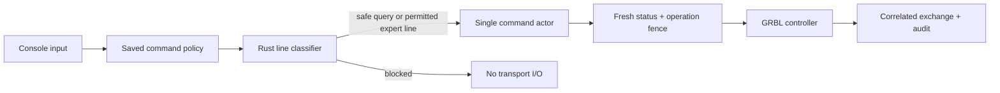

# Операторская консоль

Операторская консоль Millo работает через единственный Rust actor контроллера.
Это не прямой serial-терминал: консоль не получает порт, не читает ответы
параллельно sender и не может отправлять произвольные realtime-байты.

## Режимы

Настройка находится в `Настройки -> Приложение -> Безопасный режим команд` и
включена по умолчанию. Она сохраняется в `application-preferences.json`.

### Безопасный режим

| Команда | Назначение |
| --- | --- |
| `?` | Текущее состояние из типизированного controller snapshot |
| `$I` | Версия, build info и опции прошивки |
| `$$` | Настройки контроллера без записи |
| `$G` | Активные modal modes |
| `$#` | G54-G59, G92, TLO и PRB |

Любая другая строка блокируется до transport I/O.

### Экспертный режим

После выключения защиты консоль принимает одну печатную ASCII-строку длиной до
255 байт, например `$100=1600` или команду сторонней GRBL-совместимой прошивки.
Исходный регистр сохраняется. Команда всё равно проходит через actor и доступна
только в `Idle` или `Alarm`, когда sender, homing, jog, probe и heightmap не
владеют контроллером.

Перед командой actor заново читает status, ждёт её `ok`, `error` или `ALARM`, а
затем снова читает status. После попытки сбрасываются старые:

- разрешение на запуск обработки;
- сертификат GRBL Check;
- подтверждённый Z datum;
- homing/envelope и machine-reference evidence.

Это нужно, потому что произвольная строка могла изменить координаты, modal state,
настройки или физическое состояние станка.

`!`, `~`, Ctrl-X, overrides и `0x85` вводить в консоль нельзя. Для них остаются
кнопки Hold, Resume, Reset, overrides и Jog Cancel: это realtime-команды с другим
жизненным циклом ответа.

## Выполнение



Transcript модалки ограничен 120 записями и живёт только в текущем UI-сеансе.
Backend audit сохраняется между запусками.

## Плагины

Внешний плагин может вернуть:

```rhai
#{ kind: "rawCommand", command: "$SD/Job.nc" }
```

Команда выполнится только при capability `machine.commands`, grant для текущего
SHA-256 digest, подтверждении оператора и выключенном безопасном режиме. Плагин
не получает serial/sender handle и не может обойти занятость actor. Для обычных
макросов предпочтительны typed actions `jog`, `setZero`, `returnZero` и
`createProgram`.

## Проверка

- Rust проверяет safe allowlist, expert bounds, ASCII, запрет multiline/control
  input и typed realtime-команд.
- Actor fixtures подтверждают свежий status, сериализацию одной строки,
  отсутствие записи при safe rejection и запрет во время активного sender.
- Persistence fixtures проверяют default `true`, запись настройки и
  восстановление предыдущей копии после повреждения JSON.
- Plugin fixtures требуют `machine.commands` и валидируют `rawCommand` до actor.
- Vitest проверяет обе маркировки режима и настройку по умолчанию.
