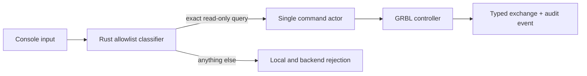

# Операторская консоль

Операторская консоль Millo предназначена для чтения диагностического состояния
GRBL. Это не прямой serial-терминал и не второй путь управления станком.

## Доступные запросы

| Команда | Назначение | Поведение |
| --- | --- | --- |
| `?` | Текущее состояние | Actor выполняет обычный status poll и возвращает строку, собранную из типизированного snapshot |
| `$I` | Версия и опции прошивки | Ответ GRBL без изменений отображается в transcript |
| `$$` | Настройки контроллера | Только чтение; запись `$n=value` запрещена |
| `$G` | Активные modal modes | Только чтение |
| `$#` | G54-G59, G92, TLO и PRB | Только чтение |

Регистр букв и внешние пробелы нормализуются. Любая другая строка блокируется до
transport I/O. В частности, консоль не принимает:

- обычный G-code, включая `G0`, `G1`, `G10` и `G38.x`;
- настройки `$n=value`, `$RST` и startup blocks;
- `$X`, `$H`, `$C`, spindle/coolant и jog;
- realtime `!`, `~`, Ctrl-X, overrides и `0x85`.

Эти операции остаются в соответствующих типизированных workflows с собственными
проверками, подтверждениями и postcondition verification.

## Выполнение

- Один Rust actor по-прежнему является единственным владельцем serial transport.
- Line-запросы выполняются только в `Idle` или `Alarm` и блокируются при активном
  sender, homing, jog, probe или heightmap.
- `?` не передаёт WebView сырой status frame. Контроллер парсит frame, обновляет
  snapshot, а console formatter строит диагностическую строку из проверенных
  полей. UI не парсит протокол GRBL.
- Reset banner, случайно полученный вместо ответа, обновляет controller snapshot,
  инвалидирует homing envelope, Z datum, check certificate и authorizations.
- Каждый успешный и отклонённый backend-запрос попадает в постоянный audit log.
  Transcript модалки ограничен 120 записями и живёт только в текущем UI-сеансе.

## Расширения

Операторская консоль не является plugin capability. Плагин не может открыть её
backend endpoint, получить actor/transport handle или расширить allowlist.
Полезная машинная операция сначала оформляется как отдельный типизированный core
use case, затем при необходимости выдаётся плагину узкой capability.

## Проверка

- Rust classifier table подтверждает точный allowlist и блокирует control chars,
  oversized input и machine-changing команды до записи в transport.
- Actor fixtures проверяют FIFO-команды и отсутствие новых байтов после rejected
  input, а также запрет line-query во время `Run`.
- Vitest проверяет palette, client-side policy и отсутствие unsafe-mode control.
- `/?fixture=console` показывает подключённый станок и детерминированные ответы
  без физического оборудования.
